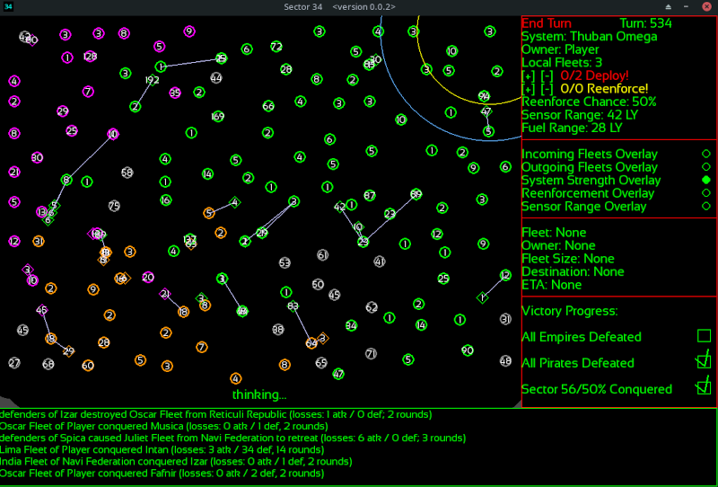
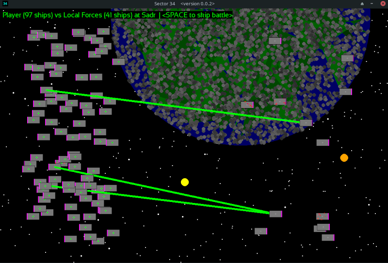

# SECTOR 34

**Description**: Sector 34 is a Space 4x-lite, inspired by games like Master of Orion, Risk, and Sword of the Stars. The goal is to unite the sector under the player's control, vying against pirates and the fellow remnants of a collapsed empire that has left the sector to its fate. To do so, they will need to be cunning and judicious in the use of their fleets. They will need to use clever timing, and out-smart the AI opponents.

**Installation**: To play from source code, you must have both a python interpreter (python 3) and pygame installed. After that, it's as simple as `python sector34.py`. If you just want to download an executable file, you can do so [here](https://sgibber2018.itch.io/sector-34). If you would like to make your own executable, I have included the `.spec` file for pyinstaller, and if you have pyinstaller and pygame installed then all you need to do is run `pyinstaller sector34.spec`, and it will bundle everything in to a single executable file.

**How to Play**: The goal of the game is to eliminate all AI empire factions (there are for now 6 of them), and subjugate all the pirate systems, as well as conquering at least 50% of the total map. This is easier said than done. To do so, the player must use their fleets. Each system on the map has a chance (randomly determined within a range, except for the player and AI homeworlds which start with a larger fixed bonus) to spawn a new unit every turn. Each system also has a sensor range (again with the player starting out with an advantage on their world). The player must decide where to place their reenforcements every turn, and then decide where to send their fleets. That's the game in a nutshell. But don't underestimate it: the AI is capable of putting up a solid fight. Especially if you let it reach critical mass. 

**Prototype**: This is just a prototype. It is a far cry from the finished game, but it's entirely playable. Currently, there is no saving/loading system, and a lot of the features I intend to implement are not in yet (tech trees, planetary improvements, multiple ship types, admirals and planetary governors, random events strategically and tactically, more off-map invasions, news blurbs, stats pages, diplomacy, trade routes, pixel art, alternate victory conditions, achievements, and much, much more). This is currently only tested on the machine on which I wrote it, which is currently running Manjaro Linux. On most Linux distributions it should run just fine, and also on Windows, and possibly also on Mac systems. In the future I will look to test it on a variety of systems and package it accordingly. I apologize for the rough edges, and I hope this does not deter too many people from trying it out.

**Pygame**: This game relies on the latest version of pygame. Other than that, there are no dependencies and I wrote it in pure Python. I am not a pygame expert. There are no doubt some things I could have done better. But I am very pleased with the speed and effectiveness with which pygame allowed me to write this game. I can't possibly give enough credit to the folks who maintain the framework.

**Music, Art and Graphics**: Currently, everything is drawn with shapes using software rendering. Pygame is based on SDL2, and proved more than capable of drawing everything from primitive shapes. There is a limit to how much of that one can do before it affects performance, and Pygame is really designed with Sprites in mind over that kind of thing. I will eventually look to replace the graphical style thus far with one based on Sprite sheets and pixel art, but I am very picky about the eventual look of the game and I won't take that step until I have secured a Sprite artist who I feel can make exactly what I want. Similarly, the game has no music or sound effects yet. I will include those when I have secured a music person for the project who can meet the standard I have in mind. The game currently plays at a set resolution, and this made it easier for me to code since I didn't have to fiddle with too many relative dimensions (the geometry is very consistent this way), but I intend to make it full-screen and upgrade the entire presentation as the project evolves (for example, a larger map that zooms and scrolls). **Update**: There are now procedurally-generated Sprite-like objects in the game, and more pre-generated Surfaces. The Art is still in an early stage though.

**License**: I have chosen the MIT license for this project. I encourage anyone interested to make pull requests or fork it for their own purposes. The world could use more 4x games.

**Font**: The font is provided by Bernd Montag under the Open Font License (see the `sansation/` directory). 

### Controls

* Holding Ctrl when using the reenforcement or deploy +/- buttons will automatically fill or empty the counter, saving many clicks. Holding shift will use increments of 10, so long as there are at least 10 to decrement or increment.

* Escape cancels deploy or reenforcement mode.

* Space will either skip a tactical battle or end the current turn.

**The following toggles can be turned on/off as the player pleases:**

* Ctrl + Shift + W for "watch mode", which allows the game to play automatically. Orders can still be given, but the AI will be responsible for your fleets and reenforcement pool. This can be toggled on/off at will. It won't be as competent as a good player, but if you've already got a big lead then it will win most of the time on its own.

* Ctrl + Shift + B to toggle the automatic skipping of tactical battle scenes. They are cool, but sometimes they can interrupt the flow of the strategy layer, and they are entirely cosmetic although procedural. The results of each battle are decided before the animation ever plays, and you can read the results in the console log.

* Ctrl + Shift + D for debug mode. Currently, this disables the fog of war and has no other effect for the player. If you just want to watch the AI play a game, then this is a fun option. Many of the things the AI does are best observed across the whole map, when it has reached critical mass with its forces.

* Ctrl + Shift + H for "hard mode". This gives a flat bonus to AI Empire ship production, to offset the player's ability to pool and bank reenforcements. They will reach critical mass much sooner, and be a much bigger challenge.

### Advanced Gameplay Tips

* At this stage of development, the AI is capable of giving the player a hard time at the beginning of the game and in certain middle- and late-game circumstances that can arise, but if the player can quickly establish a large zone of control and reenforcement income then it is very easy for the savvy player to steamroll the AI. In future versions there will be many additional improvements to the AI and more threats to consider (such as non-FTL systems promoting to Empires, more threats from off-map, and so forth). But for now, most players will find it to be pretty easy past the initial stages except during exceptional circumstances. If you should find yourself in a pickle, however, then consider the following advice:

* Bank Reenforcements: You can bank your reenforcements. This is really important. If you spend them every turn just to spend them then they aren't there to be spent at the decisive moment. On the other hand, if you never spend them then they aren't on the map for the AI to think about (see "Predict the AI", below). Always make sure you have a reason for spending reenforcements. Are you trying to deter an AI world within range from attacking? Or are you preparing for an attack? If you bank reenforcements then you can wait until the enemy fleet is literally 1 turn away before spending them. This can make the difference between success and defeat. But don't bank all of them, because you need to use your fleets actively from the start or the AI will get a potentially unsurmountable lead.

* Scout: Fleets  have a relatively large sensor range (the view in deep space is nice around these parts). By sending out small (even 1-ship) fleets just beyond the fog of war, the player can get the big picture before committing to a course of action in a way that the AI can't yet. As soon as a fleet is deployed from a world, it enjoys the full range of its sensors. This difference is very large in some cases (some of the star systems in Sector 34 simply have obstructed views, relative to the view from deep space). I suggest using this to your advantage.

* Focus on Good Conquests: Each system has a reenforcement chance and a sensor range. These are the things which differentiate them. The default reenforcement chance per turn is between 10-30% for most worlds. If you spend your initial fleet on worlds towards the higher end of that range instead of the lower one, then you'll be in a vastly better place 20 or 30 turns down the road. Similarly, conquering Pirate or AI Empire worlds effectively reduces the pressure on you in a way that conquering the non-FTL worlds does not. It isn't necessarily a disadvantage to start next to a bunch of Pirates and an AI Empire or two, because having the chance to take them out early can make a big difference (and the player starts with a decisive advantage in ships).

* Predict the AI. The AI won't attack you unless it thinks it can win. It will usually not launch ships against a world that outnumbers the fleet it would send (although by the time the fleet gets there, they might be outnumbered). Although the Pirates and the AI Empires have different aggression thresholds, both will often attack any nearby worlds that are weaker. Pay attention to the Fuel Range (the orange-yellow circle around your selected system) and Sensor Range (the blue circle) of your border planets. If your world is within fuel range of an AI-controlled system then that AI-controlled system is thinking about whether to attack it, every turn. So you should not let it be outnumbered unless you want to invite an attack. And maybe you do? If you wait for the AI to launch an attack before spending your reenforcements and launching your own, then you can secure a small victory. Furthermore, know that the AI Empires will grow very strong if left unchecked, while the Pirates only represent an early game threat (because if they blob even a little then they will just attack each other). A smart player will want to quickly knock out any early-game threats by predicting the likely behavior of the AI based on these rules. Also, the AI prefers to conserve fleets over worlds. Fleets are the most important thing. Squandering a large fleet is much worse than temporarily losing a planet. As a result, the AI plays very aggressively sometimes and will leave planets undefended. A player who plays more aggressively and takes advantage of the reenforcement pool (a huge mechanical advantage) will win most of the time. In the future, I'll add some more layers to the AI's logic to have it consider front lines more intelligently.

* Understand the Combat System: The combat is very simple. d20s are rolled, by default 3 per side. Each side compares their dice, and loses a number of ships per round equal to the amount of comparisons they lost. Ties go to the defender. There are bonus die for significantly outnumbering the opponent, allowing that side to pick the higher dice for comparison against the side with less. These rounds happen automatically, without player input. After the first round, there is a chance for the outnumbered side to retreat (the more they are outnumbered, the more likely). Retreating fleets will head to the nearest friendly system. The practical effect of this is that you don't want to be outnumbered. Even fights can go either way, but if one side enjoys an advantage of about 20% or more (or especially at 50% or more) then it is unlikely to be an upset. Large fleets are very likely to retreat long before they lose all of their ships (although sometimes they will stick it out for quite a while when losing). Only the attacker can retreat. Defending sides will always fight to the last ship to defend their star systems. There are no deep space battles at the moment, but I would like to implement them in the future. These battles happen automatically in the background, but if the player desires they can watch an animated replay which is procedurally drawn from the dice rolls in the battle (which will get much more complex and interesting down the road). Basically, if the player can ensure that they are not ever seriously outnumbered on defense, and can ensure they are always outnumbering the opponent on the attack, then they are very likely to win. But that is easier said than done, and the AI will do its best to thwart this plan. There are small bonuses that a side can get randomly every round, and/or at the start of the battle (if they are outnumbered). If an attacking fleet finds itself outnumbered it may decide to "Charge!" and will refuse to retreat, rarely, which can change the expected outcome and cause a little attrition (or waste a fleet). In general, you want to be strong where the enemy is weak, and avoid fighting the enemy when they are strong where you are weak. That is the entire key to victory.

* Trade Space for Time: If an enemy fleet of 100 ships is headed for your world with 40 ships, and you can't possibly reenforce it in time, what should you do? Those 40 ships are almost certainly goners, so why waste them? Sometimes it is smarter to retreat and let the AI take your system, just so that you can marshal your fleets and come back stronger. Attrition for attrition's sake isn't a viable strategy if you are severely outnumbered. The side with significantly superior numbers will destroy opposing ships at a high rate, and take relatively few losses. While an attritional strategy can be viable with defense in depth and close-to-parity in fleet numbers, you would just be wasting your 40 ships against those 100 the vast majority of the time. Better to trade space for time! The AI will trade space for time, retreating from unwinnable fights before your fleet arrives. Plan accordingly!

* Pirates: Pirates are very aggressive, but don't behave defensively in the same way that AI Empires do. They also don't cooperate. While Pirate neighbors can be dangerous in the early game, they are there for the taking in the mid-game. If the player doesn't take those worlds then an AI empire will. If you see Pirates "blobbing", then that's not all bad news, because those pirates will attack each other and keep each other weak. That is an opportunity for the player to swoop in and take all of their star systems before the AI Empires do. But don't underestimate them at the start of the game. They can raid from off-map, and any worlds within Fuel Range of the map's edge are at risk of being raided. The size of a raid depends on the amount of ships at the target planet, and will always be close. So, either keep lots of ships on the edge (so they can support each other), or keep few (so that raids are small and systems easily retaken).

* AI Empires: These guys are dangerous. The player starts with more ships than an AI Empire, and the player homeworld is almost twice as industrious at ship building. This is a crucial advantage for the first few turns, if you happen to start next to an AI empire. After that, they are an increasingly dangerous threat. The AI is smart enough to defend its borders, and it will shuffle fleets around looking for the best time and place to attack. AI Empires that are still alive in the late game are power-houses that aren't easily overcome. The player enjoys one main advantage: they can bank reenforcements, while the AI can't. Don't take chances with the AI Empires. Strike them smartly at the right place and the right time. Wasting a single large fleet against an AI world with too many defenders can make the difference between a won and lost game. Don't play passive against the AI Empires, or you might find yourself surrounded and outnumbered. A player who has become familiar with the game should be able to win most of the time.

* Deep Strikes: The AI Empires' systems will keep their forces in reserve rather than use them for attack if there is a big enough threat nearby. You can seize the initiative from the AI Empires by sending very large fleets to take worlds that are close to several of their own, forcing them in to a defensive posture. This only works if you can outnumber them locally for at least a little while, but it may make the difference between success and defeat in a close game.

* Local Forces: The vast majority of the sector is home to systems which no longer have the means to travel FTL. They rule their solar systems, and can't leave them. They know of the threats out there (the empire's collapse was not that long ago) and build their fleets, but will only ever use them defensively. At the start of the game these worlds are easy pickings and the player can gobble up a fair number of them without much fear. But their fleets will grow and by the late game they represent serious obstacles. Choose which of these systems to conquer carefully, because they are only cheap conquests at the very beginning of the game. They get a ship production penalty after a certain size, so that they are less of a slog in the end-game, but are still tough early game obstacles and dictate the "terrain" of the map.

* Starting Location: Starting location is a big factor in difficulty. If you are finding the game difficult, try reloading it until you start near the edge of the map (or in a corner), and are surrounded by mostly non-aligned systems. This gives the player more of a chance to build up their forces before having to deal with the AI Empire factions. For a more advanced game, try starting in the center of the map with many hostile neighbors. But note that there is no way to predict how well the AI will do against each other, and either start can lead to a very difficult endgame (or not, as the case may be).

* Rapid Expansion: The very first order of business is to secure systems. But don't cut it too close by gambling on risky ventures early, or you might find yourself in a bad way and behind the curve. Select four or five nearby systems in the 20%+ reenforcement chance range to secure immediately, if at all possible. This will give you a solid industrial base to work with. 

### Minimum Requirements:

* The only requirement is about 2 gigs of RAM and either a Windows or Linux operating system, using x86_64 architecture (arm64 is a thing I'll consider down the road). When/if I ever get a Mac environment to build the executable in, I'll put that one up here too. Sorry Mac folks, I don't mean to leave you excluded. 

### Big Bad Bugs

* Minimize the game at your own risk at the moment. Screen locking or having another window on top is just fine, but clicking the minimize button can rarely cause the game's display to bug out. To fix this I need to do a little more research on pygame. I apologize for inconvenience in the meantime. 

* Once in awhile, fleets will get stuck at 0 turns ETA for a turn or two before arriving at their destination. This is likely a small oversight on my part, and will be fixed in a future update.

