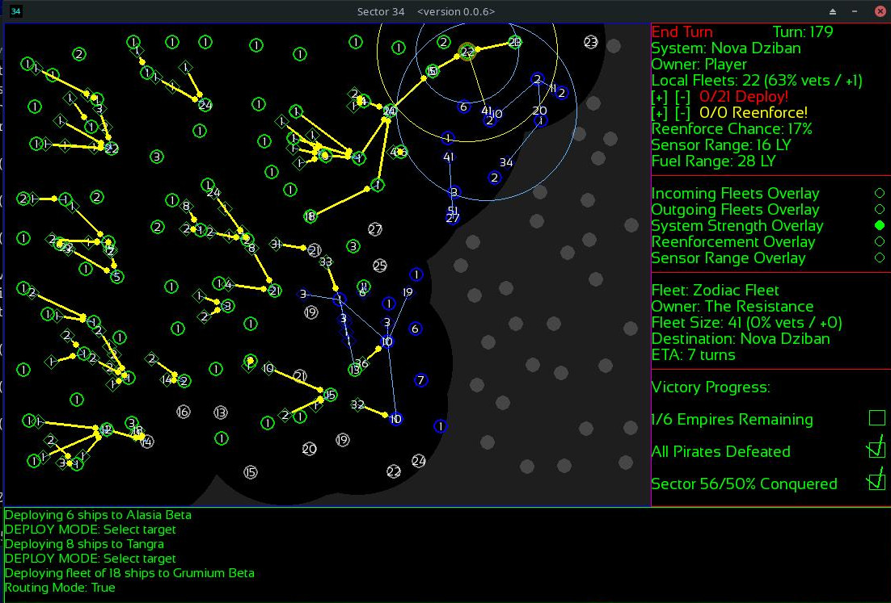
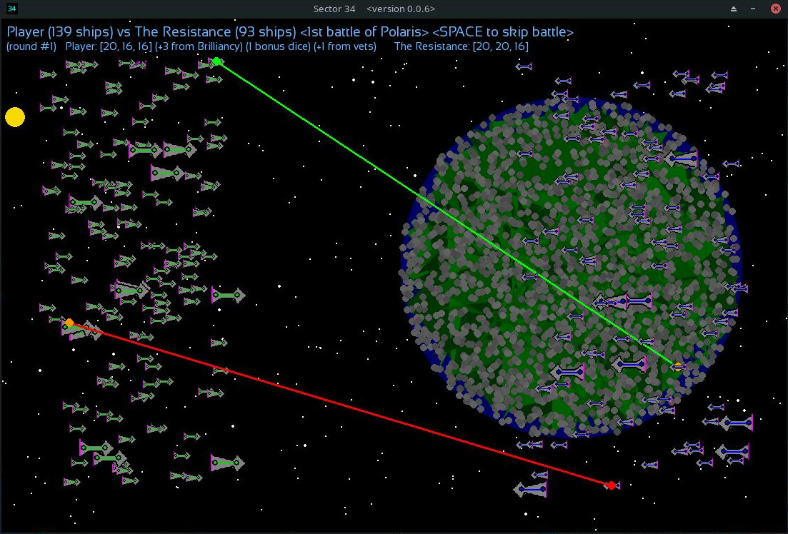
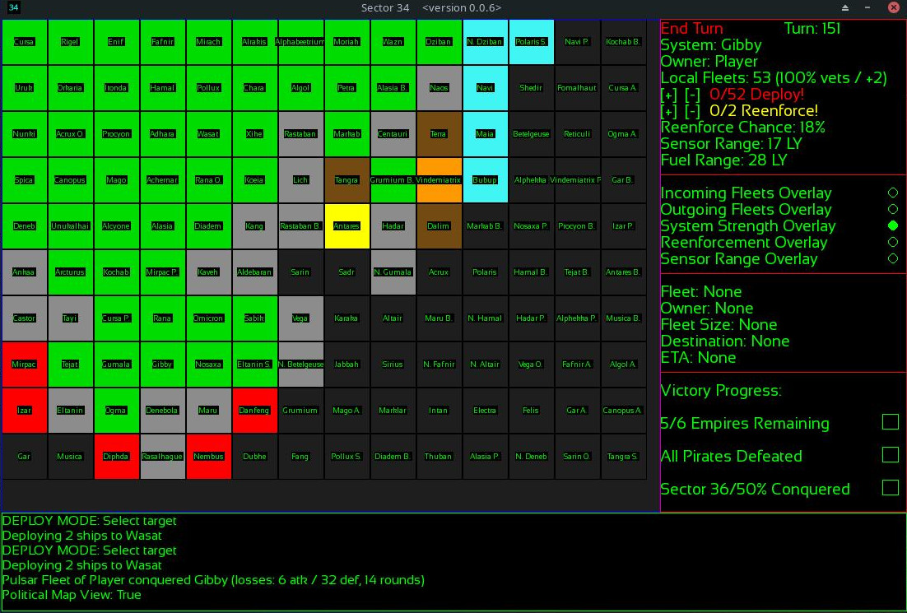
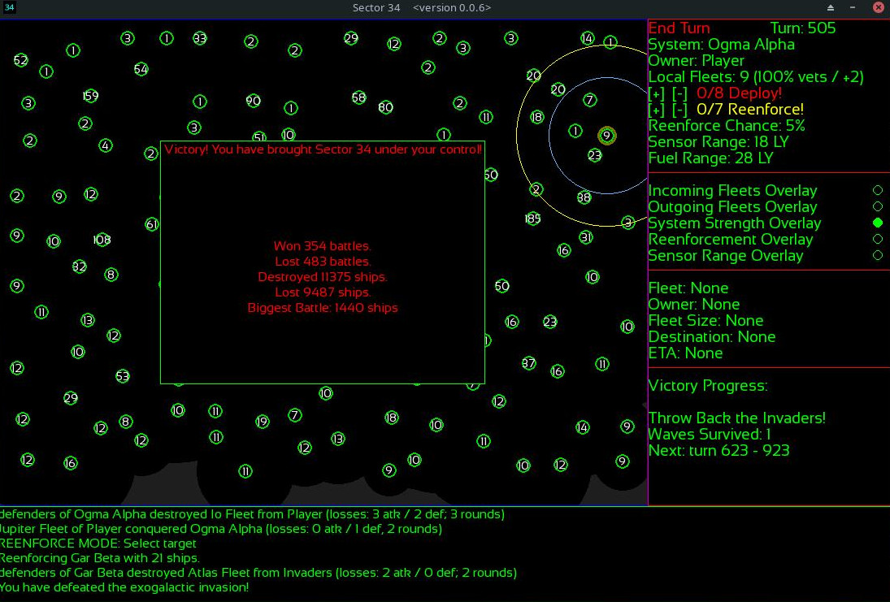
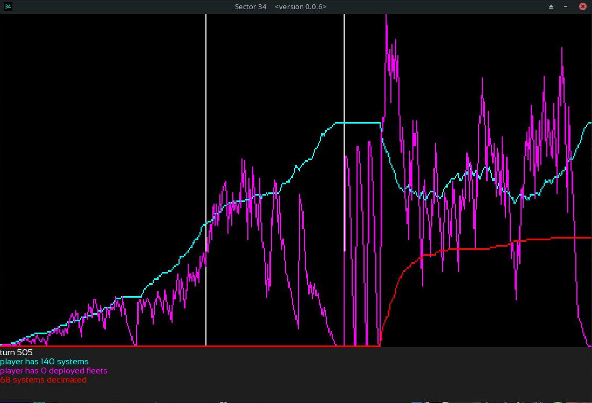

# SECTOR 34

**Description**: Sector 34 is a Space 4x-like/Risk-like/Wargame, inspired by games like Master of Orion, Risk, and Sword of the Stars. The goal is to unite the sector under the player's control, vying against pirates and the fellow remnants of a collapsed empire that has left the sector to its fate. To do so, they will need to be cunning and judicious in the use of their fleets. They will need to use clever timing, and out-smart the AI opponents. Other influences include Stellaris, GalCiv, Gratuitous Space Battles, AI War: Fleet Command, and dozens of other good games within and without the 4x genre and the strategy genres in general.

**Installation**: To play from source code, you must have both a python interpreter (python 3) and pygame installed. After that, it's as simple as `python sector34.py`. If you just want to download an executable file, you can do so [here](https://sgibber2018.itch.io/sector-34). If you would like to make your own executable, I have included the `.spec` file for pyinstaller, and if you have pyinstaller and pygame installed then all you need to do is run `pyinstaller sector34.spec`, and it will bundle everything in to a single executable file.

**How to Play**: The goal of the game is to eliminate all AI empire factions (there are for now 6 of them), and subjugate all the pirate systems, as well as conquering at least 50% of the total map. This is easier said than done. To do so, the player must use their fleets. Each system on the map has a chance (randomly determined within a range, except for the player and AI homeworlds which start with a larger fixed bonus) to spawn a new unit every turn. Each system also has a sensor range (again with the player starting out with an advantage on their world). The player must decide where to place their reenforcements every turn, and then decide where to send their fleets. That's the game in a nutshell. But don't underestimate it: the AI is capable of putting up a solid fight. Especially if you let it reach critical mass. In most playthroughs, at least one AI faction should be a powerful threat by the end game.

**Early Stages**: This is just beyond the prototype stages. It is a far cry from the finished game, but it's entirely playable. Currently, there is no saving/loading system, and a lot of the features I intend to implement are not in yet (tech trees, planetary improvements, multiple ship types, admirals and planetary governors, more random events strategically and tactically, additional stages which occur on additional maps, news blurbs, stats pages / charts, diplomacy, trade routes, more art, alternate victory conditions, achievements, and much, much more). This is currently only tested on the machine on which I wrote it, which is currently running Manjaro Linux. On most Linux distributions it should run just fine, and also on Windows, and possibly also on Mac systems. In the future I will look to test it on a variety of systems and package it accordingly. I apologize for the rough edges, and I hope this does not deter too many people from trying it out.

**Pygame**: This game relies on the latest version of pygame. Other than that, there are no dependencies and I wrote it in pure Python. I am not a pygame expert. There are no doubt some things I could have done better. But I am very pleased with the speed and effectiveness with which pygame allowed me to write this game. I can't possibly give enough credit to the folks who maintain the framework.

**Music, Art and Graphics**: The graphics in the game are all procedurally generated. Some of it is placeholder art (such as the ship sprites), while other parts I am rather happy with as permanent fixtures of the game (the planets, for example). This will evolve over time. There are no music or sound effects yet (but I'd like to include *procedural* music at some point, actually, which changes with the events occuring in the strategy layer).

**License**: I have chosen the MIT license for this project. I encourage anyone interested to make pull requests or fork it for their own purposes. The world could use more 4x games. I mostly wrote this because my gaming laptop died and I wasn't able to play Sword of the Stars. The codebase is in its infancy. Check back frequently for updates!

**Font**: The font is provided by Bernd Montag under the Open Font License (see the `sansation/` directory). And a swell font it is!

### Controls

* You can click-and-drag select multiple locations to mass-deploy fleets from. This is very helpful for massing reserves, but I have yet to implement finer control there. You will have to deploy from individual worlds to deploy less than their entire available fleet. In the future I'll have more pop-ups and GUI elements to fine-tune mass deployments in the fewest clicks.

* Holding Ctrl when using the reenforcement or deploy +/- buttons will automatically fill or empty the counter, saving many clicks. Holding shift will use increments of 10, so long as there are at least 10 to decrement or increment.

* Escape cancels deploy or reenforcement mode.

* Space will either skip a tactical battle or end the current turn.

* When multiple fleets occupy the same spot, and you have clicked on a stack of them, you can now press TAB to toggle through them in the side HUD. The selected one will be shown on top, and the others will be hidden (but their target lines will still show).

* Hold ctrl and click on locations within range of the last waypoint on the currently selected fleet's route to add waypoints to their path. These are interrupted during combat, but any number of them can be added. Loops and "waiting" periods can be added by selecting the same location more than once. (The AI will use this kind of thing more to its advantage, in the near future.) You don't need to be in routing map mode to use this control, but it's recommended since that will show the overlay.

* Hold shift and click on a location to delete the first instance of that location in the currently selected fleet's waypoint list. It will try to auto-reconnect the route, if the next location is in range, otherwise it will snip the route at the last viable waypoint. This does not require having the routing mode overlay activated, but that's recommended.

* Using the above controls, the player can now set waypoints for their fleets. Note that waypoint routes will be interrupted by combats, and should be used flexibly, as the situation changes.

**The following toggles can be turned on/off as the player pleases (ESCAPE exits all graph modes):**

* Click on a battle in the console log to view its battle graph.

* Ctrl + Shift + F and Ctrl + Shift + S for line graphs about fleets, systems, etc.

* k and j for scrolling the console up or down, respectively.

* ctrl + shift + R to show all current routes / waypoints, with the currently selected fleet shown in a different color, drawn last. 

* Ctrl + Shift + W for "watch mode", which allows the game to play automatically. Orders can still be given, but the AI will be responsible for your fleets and reenforcement pool. This can be toggled on/off at will. It won't be as competent as a good player, but if you've already got a big lead then it will win most of the time on its own.

* Ctrl + Shift + B to toggle the automatic skipping of tactical battle scenes. They are cool, but sometimes they can interrupt the flow of the strategy layer, and they are entirely cosmetic although procedural. The results of each battle are decided before the animation ever plays, and you can read the results in the console log.

* Ctrl + Shift + D for debug mode. Currently, this disables the fog of war and has no other effect for the player. If you just want to watch the AI play a game, then this is a fun option. Many of the things the AI does are best observed across the whole map, when it has reached critical mass with its forces.

* 'd' by itself, without shift + ctrl, will activate deploy mode for the currently selected systems.

* Ctrl + Shift + H for "hard mode". This gives a flat bonus to AI Empire ship production, to offset the player's ability to pool and bank reenforcements. They will reach critical mass much sooner, and be a much bigger challenge. For the invader stage, this increases their wave size by .5x. I do not recommend leaving hard mode on from the start of the game (it will probably result in unwinnable games if you do). Instead, use it as a toggle switch to set up certain fights (for example, the late stages of the FFA stage and the early part of the Coalition/Resistance stage are good times to use it).

* Ctrl + Shift + C to only show battles that are unlikely to be lopsided. This isn't fool-proof, and you'll still get some lopsided ones, but it will filter out most of the lopsided ones in the late game if you're like me and enjoy watching the gratuitous space fights when the fleets get big.

* P for a "political map".

### Advanced Gameplay Tips

The AI has come a long ways, and is capable of putting up a good fight now. Still, once players figure out how to play optimally, they should find it winnable every single game (I can't prove it's unlosable with optimal play, but I have designed such things to be very rare or non-existent once you have learned the game). That does not mean it is easy, however. You can certainly lose by bad strategy! But despite being fundamentally a dice game, good strategy should win out every game given the player's starting advantages and ability to play a bit more optimally than the AI (for now, but even when the AI is much stronger, the player has some carefully-crafted advantages). There are many features which remain to be implemented. However, if you should be finding it challenging, consider the following advice:

* Bank Reenforcements: You can bank your reenforcements. Only a small portion of the reenforcements which are generated every turn will be banked. Save these for emergencies. 

* Move Up Reserves: Most of your reenforcements spawn in place. You will want to keep an eye on your rear areas, and mass large fleets to be brought up to the front line. In the early game this is simple and obvious, but in the late game the AI will punish you in a big war for not having a little defense in depth, and reserves handy. It is best to do this in a planned way that is flexible. Don't over-commit all of your reserves to one area, and don't just bring them all up randomly. Experiment with different approaches, and discover your style here. Reserve-management is the key to winning in many cases!

* Scout: Fleets  have a relatively large sensor range (the view in deep space is nice around these parts). By sending out small (even 1-ship) fleets just beyond the fog of war, the player can get the big picture before committing to a course of action in a way that the AI can't yet. As soon as a fleet is deployed from a world, it enjoys the full range of its sensors. This difference is very large in some cases (some of the star systems in Sector 34 simply have obstructed views, relative to the view from deep space). I suggest using this to your advantage. Note that a risk of doing this is that it only takes one battle for all ships in a fleet to become veterans, so if your scout hits a world with a large fleet then suddenly that's a very dangerous place. So, use this carefully. It can save your game, if used wisely.

* Don't commit your fleets until you're sure they'll be successful. Once you send 'em, they won't turn back unless they retreat from combat, which takes at least one round (and there is a small chance for an outnumbered fleet to "charge" at the beginning of combat, which will cause attrition to the defenders but also cost you a fleet sometimes). 

* Coordinate your attacks. In a large war, the AI is ready for you all along the front line. If you attack piecemeal then they'll gobble your forces up. You need to attack multiple neighboring systems at once to be successful. But don't leave gaps for the AI factions to exploit when you just send everybody, or you might find them causing trouble behind your front lines.

* Focus on Good Conquests: Each system has a reenforcement chance and a sensor range. These are the things which differentiate them. The default reenforcement chance per turn is between 10-30% for most worlds. If you spend your initial fleet on worlds towards the higher end of that range instead of the lower one, then you'll be in a vastly better place 20 or 30 turns down the road. Similarly, conquering Pirate or AI Empire worlds effectively reduces the pressure on you in a way that conquering the non-FTL worlds does not. It isn't necessarily a disadvantage to start next to a bunch of Pirates and an AI Empire or two, because having the chance to take them out early can make a big difference (and the player starts with a decisive advantage in ships). Note that the player starts with a 50% reenforcement rate on their home system, which is far and away the best in the game. Protect this system early on, and the rest of the game is yours if you are wise about it.

* Predict the AI. The AI won't attack you unless it thinks it can win. It will usually not launch ships against a world that outnumbers the fleet it would send (although by the time the fleet gets there, they might be outnumbered), but sometimes does. Although the Pirates and the AI Empires have different aggression thresholds, both will often attack any nearby worlds that are weaker. Pay attention to the Fuel Range (the orange-yellow circle around your selected system) and Sensor Range (the blue circle) of your border planets. If your world is within fuel range of an AI-controlled system then that AI-controlled system is thinking about whether to attack it, every turn. So you should not let it be outnumbered unless you want to invite an attack. And maybe you do? If you wait for the AI to launch an attack before spending your reenforcements and launching your own, then you can secure a small victory. Furthermore, know that the AI Empires will grow very strong if left unchecked, while the Pirates only represent an early game threat (because if they blob even a little then they will just attack each other). A smart player will want to quickly knock out any early-game threats by predicting the likely behavior of the AI based on these rules. Also, the AI prefers to conserve fleets over worlds. Fleets are the most important thing. Squandering a large fleet is much worse than temporarily losing a planet. 

* Understand the Combat System: The combat is very simple. d20s are rolled, by default 3-6 per side (depending on the combined size of all fleets involved). Each side compares their dice, and loses a number of ships per round equal to the amount of comparisons they lost. Ties go to the defender. There are bonus die for significantly outnumbering the opponent, allowing that side to pick the higher dice for comparison against the side with less. Outnumber bonus dice are recalculated every round, based on the relative size of the fleets (starting first at a side being 1.5x larger). These rounds happen automatically, without player input. After the first round, there is a chance for the outnumbered side to retreat (the more they are outnumbered, the more likely). Retreating fleets will head to the nearest friendly system. The practical effect of this is that you don't want to be outnumbered. Even fights can go either way, but if one side enjoys an advantage of about 20% or more (or especially at 50% or more) then it is unlikely to be an upset. Large fleets are very likely to retreat long before they lose all of their ships (although sometimes they will stick it out for quite a while when losing). Only the attacker can retreat. Defending sides will always fight to the last ship to defend their star systems. There are no deep space battles at the moment, but I would like to implement them in the future. These battles happen automatically in the background, but if the player desires they can watch an animated replay which is procedurally drawn from the dice rolls in the battle (which will get much more complex and interesting down the road -- these animations are entirely gratuitous, and you should watch only as many as strikes your fancy). Basically, if the player can ensure that they are not ever seriously outnumbered on defense, and can ensure they are always outnumbering the opponent on the attack, then they are very likely to win. But that is easier said than done, and the AI will do its best to thwart this plan. There are small bonuses that a side can get randomly every round, and/or at the start of the battle (if they are outnumbered). If an attacking fleet finds itself outnumbered it may decide to "Charge!" and will refuse to retreat, rarely, which can change the expected outcome and cause a little attrition (or waste a fleet). In general, you want to be strong where the enemy is weak, and avoid fighting the enemy when they are strong where you are weak. That is the entire key to victory.

* More About Outnumber Bonus Dice: As of 0.0.5, the algorithm for determining outnumber dice is as follows: let X be the side with more ships, and Y be the side with less. When determining their outnumber die for a round, a loop is run which counts how many increasing multiples of `Y*1.5 (e.g. Y*1.5, Y*3, Y*4.5, Y*6, etc.)` X is greater than or equal to. That is the amount of bonus die given to the side with more ships *that round*, and this is re-calculated every round. Remember that these replace the dice in the rolled set which are lower than they are. Remember also that fleet width (the base number of die rolled per side) varies with the total number of ships involved in the engagement. This makes outnumber bonus die a powerful thing you can control throughout the game with careful use of your ships, but also a thing with diminishing returns in very large battles. Sometimes it is more important to predict that you will *gain* an outnumber die halfway through a battle than it is to try and gain one before the battle, and in some situations that may be the key to victory when you are stretched thin. Predicting the trends of losses/round per side is really the key to planning battles in this game, and while it is variable it is a thing a good player can take advantage of and use to win (in particular as it scales up towards the end of a run). But even if you math it out on paper beforehand, know that the opponent always has a few turns to react to your movements, and the numbers may change by the time your fleets arrive. You want to get a feel for these systems in general, while being flexible about your plans. Importantly, the chance for an attacking fleet to retreat is based on whether it is outnumbered. They won't consider retreating until the other side has 1 outnumber die. It is often important to know if a fleet will be likely to retreat during the course of an engagement, and this is a thing also largely within your control (minus some wrinkles such as "charge!"). This interplay between mechanics is a vital part of the game, and becoming good at it. The game assumes you are planning things in this way to some degree (at least paying attention to the rate of attrition and why some battles are won/lost at certain points), and the AI may beat you if you aren't! But know that a good human player will always crunch these numbers more effectively (whether on paper or by feel) than the AI currently does, as it uses very rough estimates for most calculations about strategic decisions. It is very exciting when you send in an outnumbered fleet that manages to turn things into a victory, and gain an outnumber die at the crucial moment! The results of every engagement affect the strategic game, and this is magnified at the end-scale of the game.

(note: I'm not a math expert, I just like games)

* Veterancy / Experience: In 0.0.5 ships become "veterans" if they participate in a single battle of any size. Fleets with 50%+ veteran ships gain a +1 bonus to all rolls in combat, throughout the entire battle. Fleets with 90%+ vets gain +2! New ships will lower the veterancy percentage in a fleet. When you mix fleets at a location they are mixed proportionally. When you deploy ships for any reason from a location it will first prioritize all the veterans in a "greedy grab", which helps both the player and the AI use them best (you want to concentrate them on attack or defense in key areas, usually). The player is currently more capable of taking advantage of this feature than the AI is, but the AI is helped by that. In the future I may add some additional toggles and/or sliders to allow finer control of which types of ships get deployed from a location. Like outnumber die, this is a thing within your control and it should affect your planning and calculations. When planning engagements, those +1/+2 on attack and defense add up, and unlike "charge!", "last stand!", and "brilliancy!" bonuses they are within the player's ability to influence on a strategic level. Combined with outnumber die, this creates a lot of opportunities to try and create certain attritional situations to your advantage, if you are clever about it. Unlike the outnumber die, this is set at the start of a battle and does not have diminishing returns at a larger scale. A side with +2 vets against a side with +0 is at an extreme advantage, even if the other side enjoys 1 outnumber die, and will cause a lot of attrition even if it doesn't win. Note that the AI does not yet directly factor this bonus into its strategic decisions, and only benefits emergently from the deployment priority built in. In the future it will factor this into immediate decisions in the same way the player does, and be a more dangerous opponent for it! Right now, if the AI sends either fresh or crack veteran troops at you, it is largely by chance.

* Trade Space for Time: If an enemy fleet of 100 ships is headed for your world with 40 ships, and you can't possibly reenforce it in time, what should you do? Those 40 ships are almost certainly goners, so why waste them? Sometimes it is smarter to retreat and let the AI take your system, just so that you can marshal your fleets and come back stronger. Attrition for attrition's sake isn't a viable strategy if you are severely outnumbered. The side with significantly superior numbers will destroy opposing ships at a high rate, and take relatively few losses. While an attritional strategy can be viable with defense in depth and close-to-parity in fleet numbers, you would just be wasting your 40 ships against those 100 the vast majority of the time. Better to trade space for time! The AI will trade space for time, retreating from unwinnable fights before your fleet arrives. Plan accordingly!

* Pirates: Pirates are very aggressive, but don't behave defensively in the same way that AI Empires do. They also don't cooperate. While Pirate neighbors can be dangerous in the early game, they are there for the taking in the mid-game. If the player doesn't take those worlds then an AI empire will. If you see Pirates "blobbing", then that's not all bad news, because those pirates will attack each other and keep each other weak. That is an opportunity for the player to swoop in and take all of their star systems before the AI Empires do. But don't underestimate them at the start of the game. They can raid from off-map, and any worlds within Fuel Range of the map's edge are at risk of being raided. The size of a raid depends on the amount of ships at the target planet, and will always be close. So, either keep lots of ships on the edge (so they can support each other), or keep few (so that raids are small and systems easily retaken).

* AI Empires: These guys are dangerous. The player starts with more ships than an AI Empire, and the player homeworld is almost twice as industrious at ship building. This is a crucial advantage for the first few turns, if you happen to start close to an AI empire. After that, they are an increasingly dangerous threat. The AI is smart enough to defend its borders, and it will shuffle fleets around looking for the best time and place to attack. AI Empires that are still alive in the late game are power-houses that aren't easily overcome. The player enjoys one main advantage: they can bank reenforcements, while the AI can't. Don't take chances with the AI Empires. Strike them smartly at the right place and the right time. Wasting a single large fleet against an AI world with too many defenders can make the difference between a won and lost game. Don't play passive against the AI Empires, or you might find yourself surrounded and outnumbered. A player who has become familiar with the game should be able to win most of the time. As of 0.0.5, the AI factions will band together into a Coalition/Resistance when the player has conquered 55% of the map, and also gain a significant ship production boost if they have less than the player (which ends when they reach parity in either ships or systems). This ensures that there is a "good fight" at the end of the free-for-all stage of the game (which is really a kind of tutorial).

* Deep Strikes: The AI Empires' systems will keep their forces in reserve rather than use them for attack if there is a big enough threat nearby. You can seize the initiative from the AI Empires by sending very large fleets to take worlds that are close to several of their own, forcing them in to a defensive posture. This only works if you can outnumber them locally for at least a little while, but it may make the difference between success and defeat in a close game.

* Local Forces: The vast majority of the sector is home to systems which no longer have the means to travel FTL. They rule their solar systems, and can't leave them. They know of the threats out there (the empire's collapse was not that long ago) and build their fleets, but will only ever use them defensively. At the start of the game these worlds are easy pickings and the player can gobble up a fair number of them without much fear. But their fleets will grow and by the late game they represent serious obstacles. Choose which of these systems to conquer carefully, because they are only cheap conquests at the very beginning of the game. They get a ship production penalty after a certain size, so that they are less of a slog in the end-game, but are still tough early game obstacles and dictate the "terrain" of the map.

* Rapid Expansion: The very first order of business is to secure systems. But don't cut it too close by gambling on risky ventures early, or you might find yourself in a bad way and behind the curve. Select a few nearby systems in the 20%+ reenforcement chance range to secure immediately, if at all possible. This will give you a solid industrial base to work with. 

* Invasion: There is a "final boss" after the player has conquered the map, in which they are invaded by forces from beyond the sector! The invaders decimate every world they touch, reducing it to 5% reenforcement chance. They themselves only reenforce in waves (of which there are six total). Each wave brings in 1.5x the *current* number of total player ships (or brings up the current invader numbers to that number). The first wave can come from any side of the map, and all succeeding waves will appear from the same side. I have included a timer which gives a rough ETA window in which the next wave will appear. All a player has to do to win this scenario is be flexible and then hold the line until the waves run out (at which point the invaders will never reenforce, and the player can outnumber them), but it is entirely possible to beat them before they have finished all of their waves. In a future version I will probably have achievements for that. I have many more interesting stages planned, based on how well this one turned out!

### Minimum Requirements:

* The only requirement is about 2 gigs of RAM and either a Windows or Linux operating system, using x86_64 architecture (arm64 is a thing I'll consider down the road). When/if I ever get a Mac environment to build the executable in, I'll put that one up here too. Sorry Mac folks, I don't mean to leave you excluded. 

### Big Bad Bugs

* Clicking the minimize button can rarely cause the game's display to bug out. Screen locking or having other windows on top is just fine, and should cause no issues.

